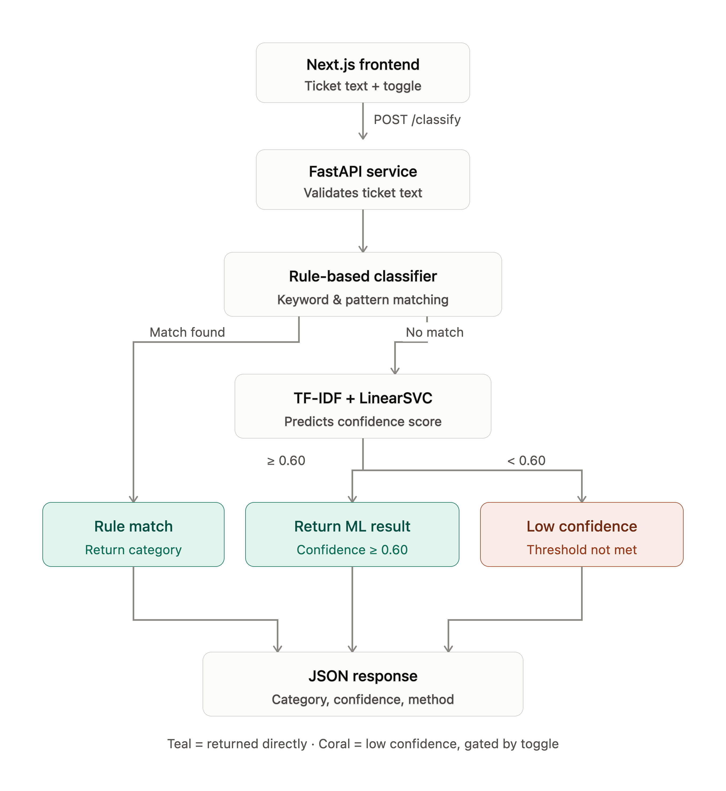
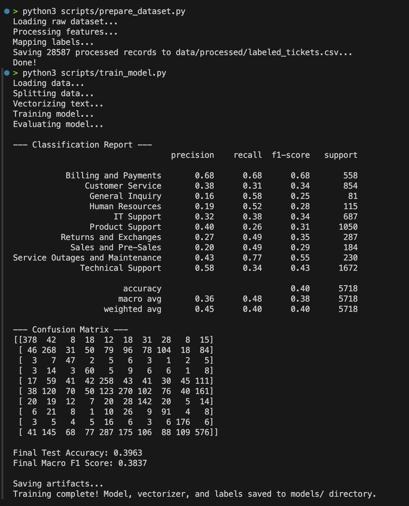
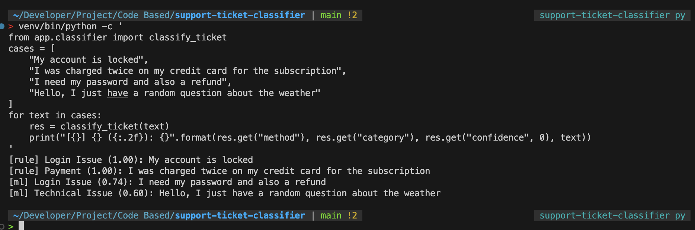
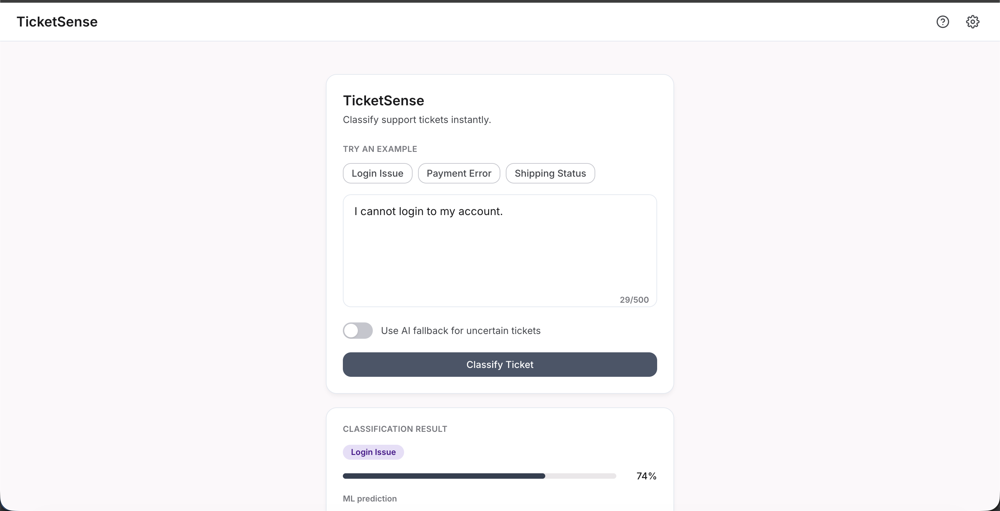
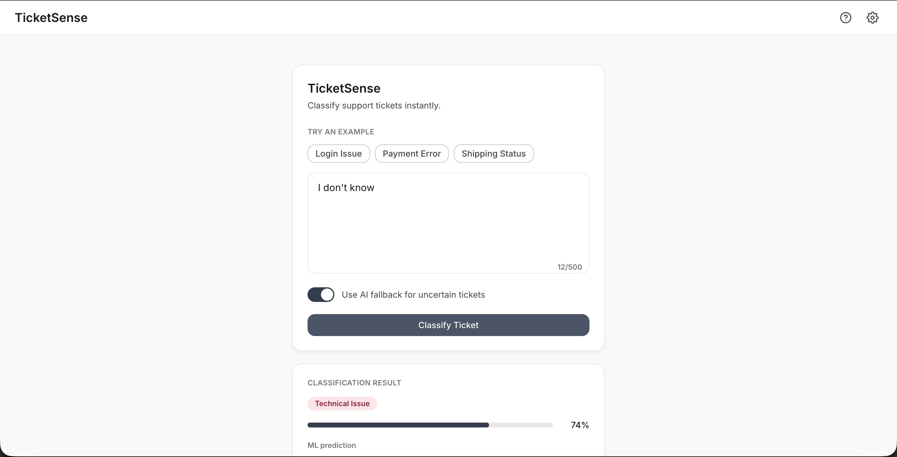

# Support Ticket Classifier

This project is a hybrid support ticket classification system designed to categorize support requests into one of six specific categories: **Login Issue**, **Payment**, **Account**, **Delivery**, **Technical Issue**, and **Others**.

## Architecture: Hybrid Rule + ML + LLM-Fallback Approach

The system employs a multi-tiered architecture for classification to balance accuracy, speed, and cost:



1.  **Rule-Based (Tier 1):** The fastest and most deterministic method. It checks for exact keyword matches (e.g., "password reset", "where is my order"). If a strong match is found, the ticket is classified immediately.
2.  **Machine Learning (Tier 2):** If rules fail, the text is vectorized using **TF-IDF** and classified using a **CalibratedClassifierCV wrapping LinearSVC** (sigmoid calibration, 5-fold CV). This handles variations in language and phrasing that strict rules miss.
3.  **LLM Fallback (Tier 3 - Optional):** If the ML model's confidence is below a predefined threshold, the ticket is routed to a Large Language Model (e.g., OpenRouter) for a final determination. The LLM acts as an intelligent safety net for ambiguous tickets.

**Frontend fallback toggle:** The Next.js UI exposes a toggle labelled "Use AI fallback for uncertain tickets". When **on**, the frontend appends `?fallback=llm` to the request (`POST /classify?fallback=llm`); when **off**, it sends a plain `POST /classify`. The backend has **no independent toggle state** — it only activates LLM logic when the `?fallback=llm` query param is present _and_ the ML tier returned `ml_low_confidence`.

**Why this approach?**

- **Cost-Efficiency:** Rules and ML are practically free and handle the bulk (80-90%) of standard tickets.
- **Low Latency:** Tiers 1 and 2 execute in milliseconds.
- **High Accuracy on Edge Cases:** The LLM fallback ensures that confusing or complex requests still get correctly routed without needing constant retraining of the ML model.

---

## Model Selection

The initial baseline used `LogisticRegression`, which achieved a macro F1 of **0.42** on the held-out test set. Switching to `LinearSVC` (with `class_weight='balanced'`, `max_iter=10000`) raised uncalibrated macro F1 to **0.54** — a meaningful gain on minority categories (Login Issue, Delivery).

`LinearSVC` does not implement `predict_proba`, which the confidence-threshold logic requires. Wrapping it in `CalibratedClassifierCV(method='sigmoid', cv=5)` adds probability estimates via Platt scaling. This comes with a small tradeoff: calibrated macro F1 settles at **0.46** (vs 0.54 uncalibrated) because sigmoid calibration smooths extreme scores toward the centre, slightly compressing high-confidence predictions. The gain in usable confidence scores outweighs this cost for the threshold-gating use case.



---

## Dataset & Label Mapping

The raw dataset uses a `queue` column with 8 distinct values. These are mapped to the 6 target categories in [`scripts/prepare_dataset.py`](scripts/prepare_dataset.py) as follows:

| Raw Queue (`queue`)                | Target Category                        | Notes                                                                                   |
| ---------------------------------- | -------------------------------------- | --------------------------------------------------------------------------------------- |
| `Billing and Payments`             | Payment                                |                                                                                         |
| `Customer Service`                 | Account                                |                                                                                         |
| `General Inquiry`                  | Others                                 |                                                                                         |
| `Human Resources`                  | Others                                 |                                                                                         |
| `Product Support`                  | Technical Issue                        |                                                                                         |
| `Returns and Exchanges`            | Delivery                               |                                                                                         |
| `Sales and Pre-Sales`              | Others                                 | Corrected from a spurious "Sales" class — not enough signal to deserve its own category |
| `Service Outages and Maintenance`  | Technical Issue                        |                                                                                         |
| `IT Support` / `Technical Support` | **Login Issue** or **Technical Issue** | Keyword sub-split (see below)                                                           |

**Keyword sub-split (IT / Technical Support):** Tickets in these queues are further split by scanning the ticket text for login-related keywords: `login`, `log in`, `password`, `otp`, `sign in`, `signin`, `authenticate`, `authentication`, `locked out`, `access denied`, `can't access my account`, `reset my password`. Any match → **Login Issue**; no match → **Technical Issue**.

---

## Confidence Threshold Behavior

The system utilizes a confidence threshold (default: `0.60`) for the Machine Learning tier:

- If the ML prediction probability is **>= threshold**, the prediction is accepted.
- If the ML prediction probability is **< threshold**, the system flags it as `ml_low_confidence`.
- If the LLM integration is active (`?fallback=llm` query param present), low-confidence tickets are routed to the LLM.
- If the LLM integration is disabled or fails, low-confidence tickets default to the **Others** category.

---

## Known Limitations

- **Dataset Mapping:** The mapping from raw queues to 6 categories is an explicit assumption and may not represent ground truth. Granular intent (e.g. billing disputes vs. refunds) is lost in the simplification.
- **Language:** The current preprocessing and ML model are optimised for **English-only** inputs. Multilingual tickets may behave unpredictably unless routed to the LLM.
- **LLM Latency & Cost:** The LLM fallback introduces 1–3 s of network latency and incurs API costs; it is optional and only triggered on low-confidence ML results with `?fallback=llm`.
- **Calibration tradeoff:** Wrapping `LinearSVC` in `CalibratedClassifierCV` (sigmoid) reduced raw macro F1 from **0.54 → 0.46** in exchange for usable `predict_proba` scores. The confidence-threshold logic depends on these scores, so the tradeoff is intentional.
- **Account / Technical Issue confusion:** These two categories are the most frequently confused pair in the confusion matrix. This is attributable to genuine overlap in the source data — tickets queued as "Customer Service" and "Product Support" share vocabulary around account access and software behaviour, which the model cannot reliably separate without richer signal.
- **Ambiguity ceiling:** Some tickets are inherently ambiguous (e.g., "My app doesn't work") and cannot be reliably classified by any tier without additional context from the user.

---

## Setup / Environment Variables

### Backend — `.env` (root directory)

Copy `.env.example` to `.env` and fill in:

```env
# Required for LLM fallback classification
OPENROUTER_API_KEY=your-openrouter-api-key-here

# Optional — default is 0.60
CONFIDENCE_THRESHOLD=0.60
```

### Frontend — `frontend/.env.local` (local dev) or Docker build arg

```env
# frontend/.env.local — used by `npm run dev`
NEXT_PUBLIC_API_URL=http://localhost:8000
```

> **Important — build-time baking:** Next.js bakes `NEXT_PUBLIC_*` variables into the static JS bundle **at compile time**, not at runtime. When deploying with Docker Compose, `NEXT_PUBLIC_API_URL` is injected via a build arg (see `docker-compose.yml` → `frontend.build.args`). Changing this value requires a full rebuild (`docker-compose up --build`), not just a container restart.

---

## Running the Application

### Initial Setup (Required Before Launch)

Since the trained model files (`.pkl`) are ignored in Git, you **must** train the model locally before running the application (whether via Docker or manually).

1. **Download the dataset:** Download the CSV file from [Kaggle: Multilingual Customer Support Tickets](https://www.kaggle.com/datasets/tobiasbueck/multilingual-customer-support-tickets?resource=download).
2. **Place the dataset:** Extract and rename the downloaded file (if necessary), then place it in the following directory:
   `data/raw/Ticket Dataset Multi-Lang.csv`
3. **Set up a virtual environment & install dependencies:**
   ```bash
   python -m venv venv
   source venv/bin/activate  # On Windows: venv\Scripts\activate
   pip install -r requirements.txt
   ```
4. **Prepare the data and train the model:**
   ```bash
   python scripts/prepare_dataset.py
   python scripts/train_model.py
   ```
   *This will generate `vectorizer.pkl`, `model.pkl`, and `labels.json` inside the `models/` directory.*

---

### Option A — Docker Compose _(recommended)_

Runs the backend API **and** the Next.js frontend together in one command. Requires Docker and Docker Compose.

1.  Copy `.env.example` to `.env` and add your `OPENROUTER_API_KEY`.
2.  Start everything:
    ```bash
    docker-compose up --build
    ```
3.  Services after startup:
    | Service | URL |
    |--------------|-------------------------------------------|
    | Frontend | http://localhost:3000 |
    | Backend API | http://localhost:8000 |
    | Swagger docs | http://localhost:8000/docs |
4.  Stop:
    ```bash
    docker-compose down
    ```

### Option B — Manual (venv)

Follow these steps to start the API directly on your host machine (assuming you have already completed the **Initial Setup** above).

#### 1. Run the FastAPI Server (Backend)

Ensure your virtual environment is activated, then start the server:

```bash
uvicorn app.main:app --host 0.0.0.0 --port 8000 --reload
```

The API will be available at `http://localhost:8000`. Interactive documentation at `http://localhost:8000/docs`.

#### 2. Run the Next.js Frontend (optional)

```bash
cd frontend
npm install
npm run dev
```

Frontend available at `http://localhost:3000`.

---

## Sample Input / Output

### UI Overview



### Fallback toggle — **OFF** (ML only)

"I want a refund" has no keyword rule match and the ML model scores it below the confidence threshold, so it is returned as **Others** with method `ml_low_confidence`.

**Request:**

```bash
curl -X POST "http://localhost:8000/classify" \
     -H "Content-Type: application/json" \
     -d '{"text": "I want a refund"}'
```

**Response:**

```json
{
  "category": "Others",
  "confidence": 0.41,
  "method": "ml_low_confidence"
}
```



---

### Fallback toggle — **ON** (LLM fallback activated)

The frontend sends `?fallback=llm`. The backend detects `ml_low_confidence` + the query param, calls the LLM, which correctly identifies a refund request as a payment/returns issue.

**Request:**

```bash
curl -X POST "http://localhost:8000/classify?fallback=llm" \
     -H "Content-Type: application/json" \
     -d '{"text": "I want a refund"}'
```

**Response:**

```json
{
  "category": "Payment",
  "confidence": 0.91,
  "method": "llm_fallback"
}
```



---

### Additional cURL examples

#### Login Issue (rule-based)

```bash
curl -X POST "http://localhost:8000/classify" \
     -H "Content-Type: application/json" \
     -d '{"text": "I forgot my password and cannot log into my portal."}'
```

```json
{ "category": "Login Issue", "confidence": 1.0, "method": "rule" }
```

#### Payment (ML)

```bash
curl -X POST "http://localhost:8000/classify" \
     -H "Content-Type: application/json" \
     -d '{"text": "I was double charged for my subscription this month."}'
```

```json
{ "category": "Payment", "confidence": 0.88, "method": "ml" }
```

#### Delivery (rule-based)

```bash
curl -X POST "http://localhost:8000/classify" \
     -H "Content-Type: application/json" \
     -d '{"text": "My tracking number says delivered but I havent received the package."}'
```

```json
{ "category": "Delivery", "confidence": 1.0, "method": "rule" }
```
